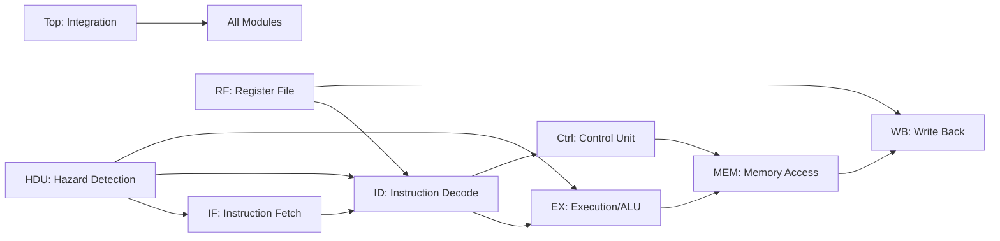
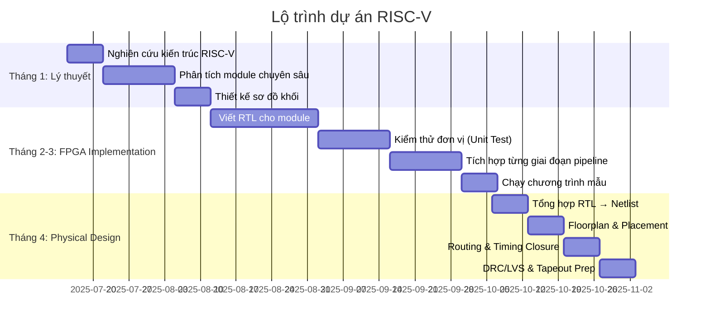

### Kế hoạch Phân Nhóm & Triển Khai Dự án RISC-V

#### **Tổng quan kiến trúc RISC-V (9 module)**

#### **Phân nhóm & nhiệm vụ chi tiết**
1. **Group 1: Instruction Fetch (IF)**  
   - Nhiệm vụ: Truy xuất lệnh từ bộ nhớ, quản lý Program Counter  

2. **Group 2: Instruction Decode (ID)**  
   - Nhiệm vụ: Giải mã lệnh, xác định toán hạng  

3. **Group 3: ALU & Execution (EX)**  
   - Nhiệm vụ: Thực thi phép toán số học/logic  

4. **Group 4: Memory Access (MEM)**  
   - Nhiệm vụ: Quản lý bộ nhớ dữ liệu (load/store)  

5. **Group 5: Write Back (WB)**  
   - Nhiệm vụ: Ghi kết quả vào Register File  

6. **Group 6: Control Unit (CTRL)**  
   - Nhiệm vụ: Tạo tín hiệu điều khiển pipeline  

7. **Group 7: Hazard Detection (HDU)**  
   - Nhiệm vụ: Xử lý xung đột dữ liệu & điều khiển pipeline  

8. **Group 8: Register File (RF)**  
   - Nhiệm vụ: Quản lý thanh ghi, forward dữ liệu  

9. **Group 9: Top-Level Integration (TOP)**  
   - Nhiệm vụ: Tích hợp toàn hệ thống, kiểm thử FPGA  

---

#### **Lộ trình thời gian (4 tháng)** 

#### **Cơ chế phối hợp**
1. **Tuần họp chéo**:  
   - Mỗi thứ 6: 1 nhóm trình bày tiến độ, các nhóm liên quan thảo luận interface  
   - Ví dụ: Nhóm IF + ID kiểm tra bộ đệm lệnh; Nhóm EX + MEM kiểm tra bộ nhớ đệm dữ liệu  

2. **Hệ thống tài liệu**:  
   - Sử dụng GitHub cho RTL code + testbench  
   - Google Drive lưu spec, báo cáo tuần, sơ đồ thời gian  

3. **Đánh giá**:  
   - Tuần 4/tháng: Demo chức năng module (trên ModelSim)  
   - Cuối tháng 3: Demo toàn hệ thống trên FPGA (chạy chương trình mẫu)  
   - Cuối tháng 4: Báo cáo Physical Design (diện tích, timing, công suất)  

---

#### **Tài nguyên hỗ trợ**
- **Sách tham khảo**:  
  *Digital Design and Computer Architecture (RISC-V Edition)* - David Harris  
  *RISC-V User-Level ISA Specification*  
- **Công cụ**:  
  FPGA: Xilinx Vivado (bản Education)  
  Physical Design: Synopsys/Cadence (bản sinh viên)  
- **Mẫu kiểm thử**:  
  Chương trình tính Fibonacci, giải phương trình bậc 2  

> **Lưu ý**: Nhóm 9 (TOP) đóng vai trò hỗ trợ kỹ thuật xuyên suốt, đảm bảo các module kết nối chính xác và tối ưu hóa tài nguyên FPGA.
