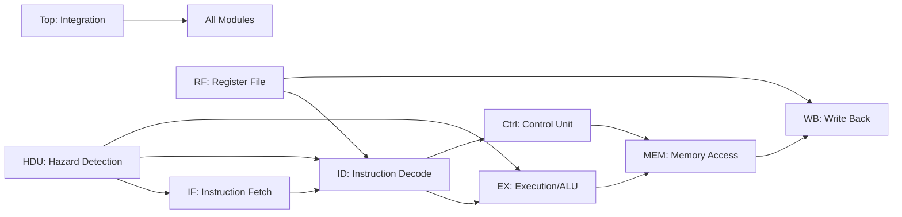
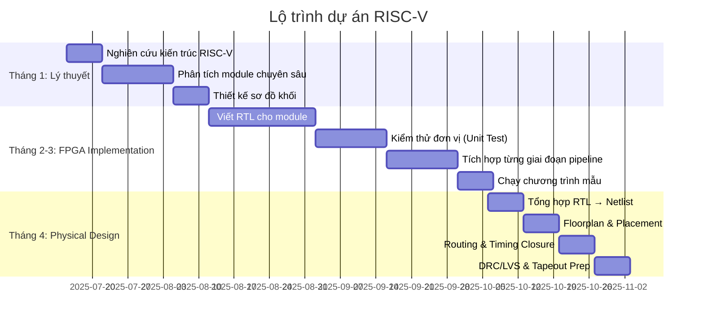

### Kế hoạch Phân Nhóm & Triển Khai Dự án RISC-V

#### **Tổng quan kiến trúc RISC-V (9 module)**

#### **Phân nhóm & nhiệm vụ chi tiết**
1. **Group 1: Instruction Fetch (IF)**  
   - Nhiệm vụ: Truy xuất lệnh từ bộ nhớ, quản lý Program Counter  
   - Sinh viên:  
     - Đặng Tuấn Anh (N21DCDT004)  
     - Trần Ngọc Dương (N21DCDT019)  
     - Phạm Minh Nhựt (N21DCDT068)  
     - Hoàng Trọng Quyền (N21DCDT078)  
     - Nguyễn Tuấn Anh (N21DCDT005 - **Physical Design**)  

2. **Group 2: Instruction Decode (ID)**  
   - Nhiệm vụ: Giải mã lệnh, xác định toán hạng  
   - Sinh viên:  
     - Đoàn Quang Hải (N21DCDT027)  
     - Lâm Công Truyền (N21DCDT096)  
     - Nguyễn Thái Vinh (N21DCDT102)  
     - Hoàng Minh Vương (N21DCDT105)  
     - Nguyễn Minh Đức (N21DCDT025 - **Physical Design**)  

3. **Group 3: ALU & Execution (EX)**  
   - Nhiệm vụ: Thực thi phép toán số học/logic  
   - Sinh viên:  
     - Trần Tiến Đạt (N21DCDT023)  
     - Nguyễn Khánh Hoàng (N21DCDT031)  
     - Nguyễn Bình Minh (N21DCDT059)  
     - Bùi Minh Đức (N21DCDT016 - **Physical Design**)  
     - Lương Phúc Minh Duy (N21DCDT018 - **Verification**)  

4. **Group 4: Memory Access (MEM)**  
   - Nhiệm vụ: Quản lý bộ nhớ dữ liệu (load/store)  
   - Sinh viên:  
     - Phạm Văn Minh (N21DCDT061)  
     - Dương Đức Phúc (N21DCDT070)  
     - Nguyễn Việt Hưng (N21DCDT039)  
     - Võ Phúc Nguyên (N21DCDT063)  
     - Đỗ Gia Hưng (N21DCDT038 - **Physical Design**)  

5. **Group 5: Write Back (WB)**  
   - Nhiệm vụ: Ghi kết quả vào Register File  
   - Sinh viên:  
     - Nguyễn Quí Thái (N21DCDT081)  
     - Lê Trung Kiên (N21DCDT051)  
     - Hà Minh Trí (N21DCDT092)  
     - Nguyễn Đức Tường (N21DCDT099)  
     - Nguyễn Đào Minh Khoa (N21DCDT047 - **Physical Design**)  

6. **Group 6: Control Unit (CTRL)**  
   - Nhiệm vụ: Tạo tín hiệu điều khiển pipeline  
   - Sinh viên:  
     - Nguyễn Tuấn Vũ (N21DCDT104)  
     - Trần Thành Lợi (N21DCDT055)  
     - Đoàn Minh Quân (N21DCDT074)  
     - Nguyễn Hoàng Phú (N21DCDT069)  
     - Đỗ Việt Cường (N21DCDT013 - **Verification+Physical**)  

7. **Group 7: Hazard Detection (HDU)**  
   - Nhiệm vụ: Xử lý xung đột dữ liệu & điều khiển pipeline  
   - Sinh viên:  
     - Trần Văn Quốc (N21DCDT077)  
     - Trần Chánh Tính (N21DCDT090)  
     - Nguyễn Quang Hoàng Việt (N21DCDT100)  
     - Lê Đức Lợi (N21DCDT054 - **Physical Design**)  
     - Nguyễn Minh Khánh (N21DCDT045 - **Verification**)  

8. **Group 8: Register File (RF)**  
   - Nhiệm vụ: Quản lý thanh ghi, forward dữ liệu  
   - Sinh viên:  
     - Nguyễn Việt Thành (N21DCDT083)  
     - Trần Minh Kháng (N21DCDT044)  
     - Nguyễn Thành Thắng (N21DCDT084)  
     - Nguyễn Quốc Bình (N21DCDT008 - **Physical Design**)  
     - Lê Ngọc Huy Hoàng (N21DCDT030 - **Verification**)  

9. **Group 9: Top-Level Integration (TOP)**  
   - Nhiệm vụ: Tích hợp toàn hệ thống, kiểm thử FPGA  
   - Sinh viên:  
     - Nguyễn Minh Chiến (N21DCDT010 - **FPGA**)  
     - Phạm Tiến Phúc Hưng (N21DCDT040 - **Verification**)  
     - Nguyễn Huỳnh Hoàng Tính (N21DCDT089 - **Physical Design**)  
     - Hà Quốc Tuấn (N21DCDT097 - **Physical Design**)  
     - Đặng Văn Vũ (N21DCDT103)  

---

#### **Lộ trình thời gian (4 tháng)** 

#### **Cơ chế phối hợp**
1. **Tuần họp chéo**:  
   - Mỗi thứ 6: 1 nhóm trình bày tiến độ, các nhóm liên quan thảo luận interface  
   - Ví dụ: Nhóm IF + ID kiểm tra bộ đệm lệnh; Nhóm EX + MEM kiểm tra bộ nhớ đệm dữ liệu  

2. **Hệ thống tài liệu**:  
   - Sử dụng GitHub cho RTL code + testbench  
   - Google Drive lưu spec, báo cáo tuần, sơ đồ thời gian  

3. **Đánh giá**:  
   - Tuần 4/tháng: Demo chức năng module (trên ModelSim)  
   - Cuối tháng 3: Demo toàn hệ thống trên FPGA (chạy chương trình mẫu)  
   - Cuối tháng 4: Báo cáo Physical Design (diện tích, timing, công suất)  

---

#### **Tài nguyên hỗ trợ**
- **Sách tham khảo**:  
  *Digital Design and Computer Architecture (RISC-V Edition)* - David Harris  
  *RISC-V User-Level ISA Specification*  
- **Công cụ**:  
  FPGA: Xilinx Vivado (bản Education)  
  Physical Design: Synopsys/Cadence (bản sinh viên)  
- **Mẫu kiểm thử**:  
  Chương trình tính Fibonacci, giải phương trình bậc 2  

> **Lưu ý**: Nhóm 9 (TOP) đóng vai trò hỗ trợ kỹ thuật xuyên suốt, đảm bảo các module kết nối chính xác và tối ưu hóa tài nguyên FPGA.
